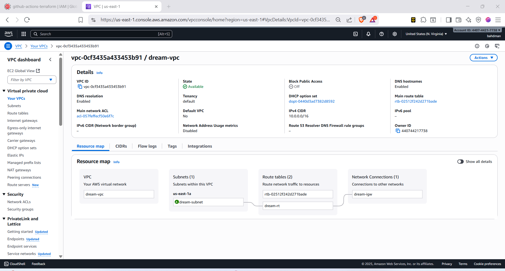
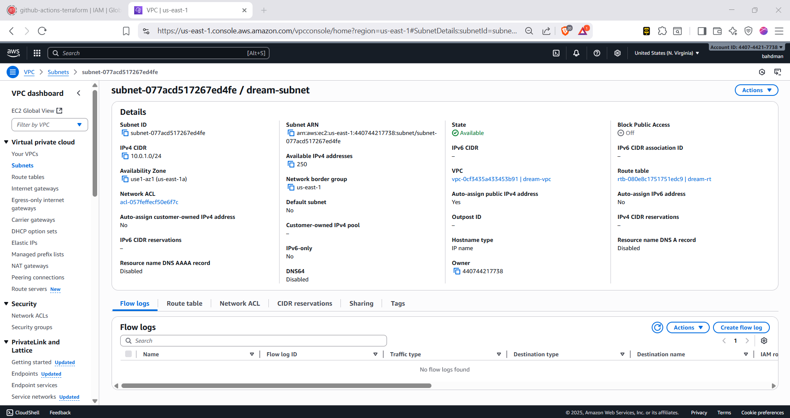
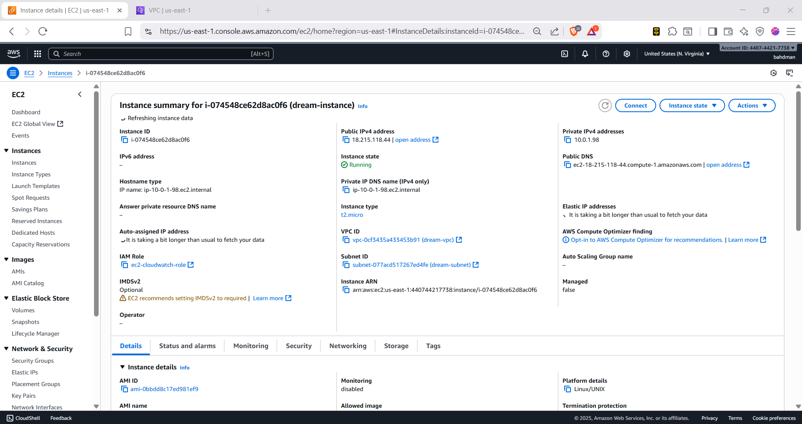
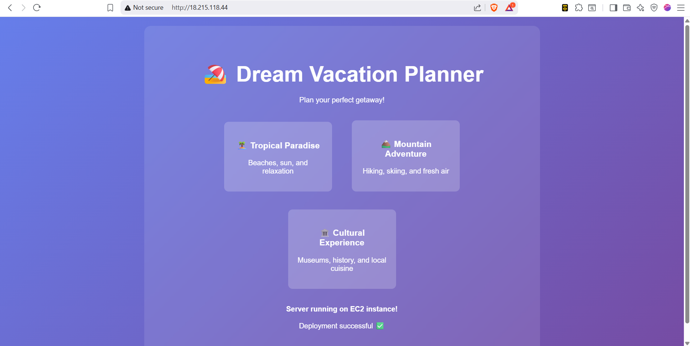
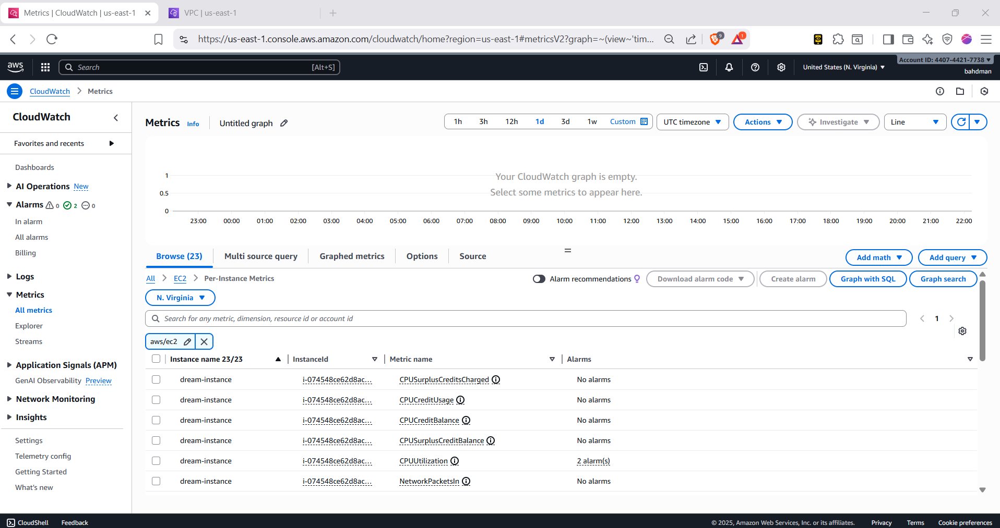
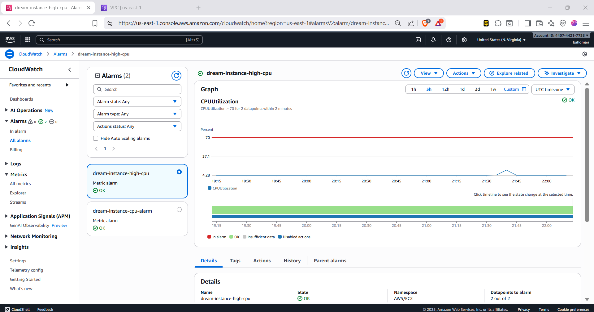

# Dream Vacation App - AWS Infrastructure & CI/CD Deployment

## Project Overview
This project demonstrates the complete deployment of a full-stack Dream Vacation App using AWS infrastructure provisioned with Terraform and automated CI/CD deployment using GitHub Actions.

## Architecture
- **Frontend**: React application (Port 80)
- **Backend**: Node.js API (Port 5000)
- **Infrastructure**: AWS VPC, EC2, CloudWatch
- **Deployment**: Automated CI/CD with GitHub Actions
- **Monitoring**: CloudWatch CPU utilization alarms

---

## Part 1: Networking Setup (Terraform)

### VPC Configuration
```hcl
# VPC
resource "aws_vpc" "dream_vpc" {
  cidr_block           = "10.0.0.0/16"
  enable_dns_hostnames = true
  enable_dns_support   = true

  tags = {
    Name = "dream-vpc"
  }
}

# Internet Gateway
resource "aws_internet_gateway" "dream_igw" {
  vpc_id = aws_vpc.dream_vpc.id

  tags = {
    Name = "dream-igw"
  }
}

# Subnet
resource "aws_subnet" "dream_subnet" {
  vpc_id                  = aws_vpc.dream_vpc.id
  cidr_block              = "10.0.1.0/24"
  availability_zone       = data.aws_availability_zones.available.names[0]
  map_public_ip_on_launch = true

  tags = {
    Name = "dream-subnet"
  }
}

# Route Table
resource "aws_route_table" "dream_rt" {
  vpc_id = aws_vpc.dream_vpc.id

  route {
    cidr_block = "0.0.0.0/0"
    gateway_id = aws_internet_gateway.dream_igw.id
  }

  tags = {
    Name = "dream-rt"
  }
}

# Route Table Association
resource "aws_route_table_association" "dream_subnet_association" {
  subnet_id      = aws_subnet.dream_subnet.id
  route_table_id = aws_route_table.dream_rt.id
}
```

---

## Part 2: EC2 Instance Setup (Terraform)

### Security Group Configuration
```hcl
# Security Group
resource "aws_security_group" "dream_sg" {
  name        = "dream-security-group"
  description = "Security group for Dream Vacation App"
  vpc_id      = aws_vpc.dream_vpc.id

  ingress {
    from_port   = 22
    to_port     = 22
    protocol    = "tcp"
    cidr_blocks = ["0.0.0.0/0"]
  }

  ingress {
    from_port   = 80
    to_port     = 80
    protocol    = "tcp"
    cidr_blocks = ["0.0.0.0/0"]
  }

  egress {
    from_port   = 0
    to_port     = 0
    protocol    = "-1"
    cidr_blocks = ["0.0.0.0/0"]
  }

  tags = {
    Name = "dream-security-group"
  }
}
```

### EC2 Instance Configuration
```hcl
# EC2 Instance
resource "aws_instance" "dream_instance" {
  ami                    = data.aws_ami.ubuntu.id
  instance_type          = "t2.micro"
  key_name              = aws_key_pair.dream_key.key_name
  vpc_security_group_ids = [aws_security_group.dream_sg.id]
  subnet_id             = aws_subnet.dream_subnet.id
  iam_instance_profile  = aws_iam_instance_profile.ec2_profile.name

  user_data = base64encode(file("${path.module}/user_data.sh"))

  tags = {
    Name = "dream-instance"
  }
}
```

### User Data Script
```bash
#!/bin/bash
set -e

# Update system
apt-get update -y

# Install Docker
apt-get install -y apt-transport-https ca-certificates curl gnupg lsb-release
curl -fsSL https://download.docker.com/linux/ubuntu/gpg | gpg --dearmor -o /usr/share/keyrings/docker-archive-keyring.gpg
echo "deb [arch=amd64 signed-by=/usr/share/keyrings/docker-archive-keyring.gpg] https://download.docker.com/linux/ubuntu $(lsb_release -cs) stable" | tee /etc/apt/sources.list.d/docker.list > /dev/null
apt-get update -y
apt-get install -y docker-ce docker-ce-cli containerd.io

# Install Docker Compose
curl -L "https://github.com/docker/compose/releases/latest/download/docker-compose-$(uname -s)-$(uname -m)" -o /usr/local/bin/docker-compose
chmod +x /usr/local/bin/docker-compose

# Start Docker service
systemctl start docker
systemctl enable docker
usermod -aG docker ubuntu

# Install CloudWatch Agent
wget https://amazoncloudwatch-agent.s3.amazonaws.com/ubuntu/amd64/latest/amazon-cloudwatch-agent.deb
dpkg -i amazon-cloudwatch-agent.deb
systemctl enable amazon-cloudwatch-agent
systemctl start amazon-cloudwatch-agent
```

---

## Part 3: CloudWatch Monitoring (Terraform)

### CloudWatch Alarm Configuration
```hcl
# CloudWatch Alarm for CPU Utilization
resource "aws_cloudwatch_metric_alarm" "cpu_alarm" {
  alarm_name          = "dream-instance-cpu-alarm"
  comparison_operator = "GreaterThanThreshold"
  evaluation_periods  = "2"
  metric_name         = "CPUUtilization"
  namespace           = "AWS/EC2"
  period              = "60"
  statistic           = "Average"
  threshold           = "70"
  alarm_description   = "This metric monitors EC2 CPU utilization"

  dimensions = {
    InstanceId = aws_instance.dream_instance.id
  }

  tags = {
    Name = "dream-cpu-alarm"
  }
}
```

### IAM Role for CloudWatch
```hcl
# IAM Role for EC2 CloudWatch permissions
resource "aws_iam_role" "ec2_cloudwatch_role" {
  name = "ec2-cloudwatch-role"
  
  assume_role_policy = jsonencode({
    Version = "2012-10-17"
    Statement = [
      {
        Action = "sts:AssumeRole"
        Effect = "Allow"
        Principal = {
          Service = "ec2.amazonaws.com"
        }
      }
    ]
  })
}

# IAM Instance Profile
resource "aws_iam_instance_profile" "ec2_profile" {
  name = "ec2-cloudwatch-profile"
  role = aws_iam_role.ec2_cloudwatch_role.name
}
```

---

## Part 4: CI/CD Pipeline Configuration

### GitHub Actions Workflow
```yaml
name: Deploy Dream Vacation App

on:
  push:
    branches: [ main ]

env:
  FRONTEND_IMAGE: bashtech007/dream-vacation-frontend
  BACKEND_IMAGE: bashtech007/dream-vacation-backend

jobs:
  build-frontend:
    runs-on: ubuntu-latest
    steps:
    - uses: actions/checkout@v3
    - name: Log in to Docker Hub
      uses: docker/login-action@v2
      with:
        username: ${{ secrets.DOCKER_USERNAME }}
        password: ${{ secrets.DOCKER_PASSWORD }}
    - name: Build and push Frontend
      uses: docker/build-push-action@v4
      with:
        context: ./frontend
        push: true
        tags: ${{ env.FRONTEND_IMAGE }}:latest

  terraform:
    needs: [build-frontend, build-backend]
    runs-on: ubuntu-latest
    steps:
    - uses: actions/checkout@v3
    - name: Setup Terraform
      uses: hashicorp/setup-terraform@v2
    - name: Configure AWS credentials
      uses: aws-actions/configure-aws-credentials@v2
      with:
        aws-access-key-id: ${{ secrets.AWS_ACCESS_KEY_ID }}
        aws-secret-access-key: ${{ secrets.AWS_SECRET_ACCESS_KEY }}
        aws-region: us-east-1
    - name: Terraform Apply
      working-directory: ./terraform-infrastructure
      run: |
        terraform init
        terraform plan
        terraform apply -auto-approve

  deploy:
    needs: terraform
    runs-on: ubuntu-latest
    steps:
    - name: Deploy to EC2
      uses: appleboy/ssh-action@v0.1.5
      with:
        host: 18.215.118.44
        username: ubuntu
        key: ${{ secrets.EC2_SSH_KEY }}
        script: |
          cd ~/dream-vacation-app
          sudo docker-compose down || true
          sudo docker pull bashtech007/dream-vacation-frontend:latest
          sudo docker pull bashtech007/dream-vacation-backend:latest
          sudo docker-compose up -d
```

---

## Deployment Information

### Infrastructure Details
- **VPC CIDR**: 10.0.0.0/16
- **Subnet CIDR**: 10.0.1.0/24
- **EC2 Instance Type**: t2.micro
- **EC2 Public IP**: 18.215.118.44
- **Application URL**: http://18.215.118.44

### Docker Images
- **Frontend**: bashtech007/dream-vacation-frontend:latest
- **Backend**: bashtech007/dream-vacation-backend:latest

---

## Screenshots

### 1. VPC and Subnet in AWS Console

*VPC (dream-vpc) and Subnet (dream-subnet) created via Terraform*
### though they are together i decided to seperate it

*VPC (dream-vpc) and Subnet (dream-subnet) created via Terraform*

### 2. EC2 Instance Running

*EC2 instance (dream-instance) running Ubuntu LTS*

### 3. Dream Vacation App in Browser

*Dream Vacation App accessible at http://18.215.118.44*

### 4.1 CloudWatch CPU Metrics 

### Though they are the same i seperated it
### 4.2 CloudWatch CPU Alarms

*CloudWatch alarm monitoring CPU utilization > 70%*

### 5. CI/CD Pipeline Logs
<!--  -->
*GitHub Actions pipeline successfully deploying infrastructure and application*

---

## Testing and Verification

### Manual Testing Steps
1. SSH into EC2 instance: `ssh -i ~/.ssh/id_rsa ubuntu@18.215.118.44`
2. Verify Docker containers: `sudo docker ps`
3. Check application logs: `sudo docker-compose logs`
4. Test application: Visit http://18.215.118.44

### Monitoring Verification
1. Check CloudWatch metrics for CPU utilization
2. Verify CloudWatch alarm configuration
3. Monitor application performance

---

## Troubleshooting

### Common Issues
- **SSH Connection**: Ensure security group allows port 22
- **Application Access**: Verify security group allows port 80
- **Docker Issues**: Check `sudo systemctl status docker`
- **CloudWatch**: Verify IAM permissions for EC2 instance

### Useful Commands
```bash
# Check running containers
sudo docker ps

# View application logs
sudo docker-compose logs

# Restart services
sudo docker-compose restart

# Check CloudWatch agent status
sudo systemctl status amazon-cloudwatch-agent
```

---

## Resources Created

| Resource Type | Name | Purpose |
|---------------|------|---------|
| VPC | dream-vpc | Network isolation |
| Subnet | dream-subnet | Public subnet for EC2 |
| Internet Gateway | dream-igw | Internet access |
| Route Table | dream-rt | Routing configuration |
| Security Group | dream-security-group | Firewall rules |
| EC2 Instance | dream-instance | Application host |
| CloudWatch Alarm | dream-cpu-alarm | CPU monitoring |
| IAM Role | ec2-cloudwatch-role | CloudWatch permissions |

---

## Project Structure
```
Dream-Vacation-App/
├── backend/                 # Backend Node.js application
├── frontend/               # Frontend React application
├── terraform-infrastructure/  # AWS infrastructure code
│   ├── main.tf
│   ├── variables.tf
│   ├── outputs.tf
│   ├── cloudwatch.tf
│   └── user_data.sh
├── .github/workflows/      # CI/CD pipelines
│   ├── backend.yml
│   ├── frontend.yml
│   └── deploy.yml
├── docker-compose.yml      # Multi-service container configuration
└── README.md              # This file
```

---

## Conclusion

This project successfully demonstrates:
- ✅ Infrastructure as Code using Terraform
- ✅ Automated CI/CD deployment with GitHub Actions
- ✅ CloudWatch monitoring and alerting
- ✅ Containerized application deployment
- ✅ Full-stack application hosting on AWS

**Application URL**: http://18.215.118.44
**Monitoring**: CloudWatch CPU utilization alarm configured for >70% threshold